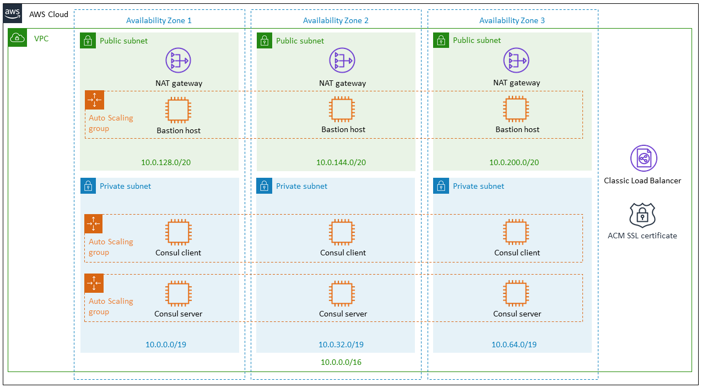

Deploying this Quick Start for a new virtual private cloud (VPC) with
*default parameters* builds the following _{partner-product-name}_ environment in the
AWS Cloud.For details about the VPC architecture, see the Amazon VPC Quick Start Guide.)

// Replace this example diagram with your own. Send us your source PowerPoint file. Be sure to follow our guidelines here : http://(we should include these points on our contributors giude)
[#architecture1]
.Quick Start architecture for _{partner-product-name}_ on AWS
[link=images/architecture_diagram.png]

As shown in Figure 1, the Quick Start sets up the following:

* A highly available architecture that spans three Availability Zones.*
* A VPC configured with public and private subnets, according to AWS
best practices, to provide you with your own virtual network on AWS.*

In the public subnets:

* Linux bastion hosts to allow inbound Secure Shell (SSH) access to EC2 instances in
the private subnets.*

* Managed network address translation (NAT) gateways to allow outbound internet
access for resources in the private subnets.*

* A Classic Load Balancer with AWS Certificate Manager (ACM) attached to the
{partner-product-name} server cluster Auto Scaling group. You can choose to add your own Secure
Sockets Layer (SSL) certificate to it. 

In the private subnets:

* An Auto Scaling group for {partner-product-name} clients. The number of clients is set to 0 by default,
but is user-configurable.

* An Auto Scaling group for a {partner-product-name} server cluster in the private subnets. You can
choose to create 3, 5, or 7 servers.

* {partner-product-name} Template (the {partner-product-name}-template daemon) installed on all nodes for
integrating applications with {partner-product-name}'s service catalog and key/value store.

* *Dnsmasq* installed on all nodes for integrating applications with Con{partner-product-name}'s sul’s Domain
Name System (DNS) interface for service discovery

*The template that deploys the Quick Start into an existing VPC skips
the components marked by asterisks and prompts you for your existing VPC
configuration.
